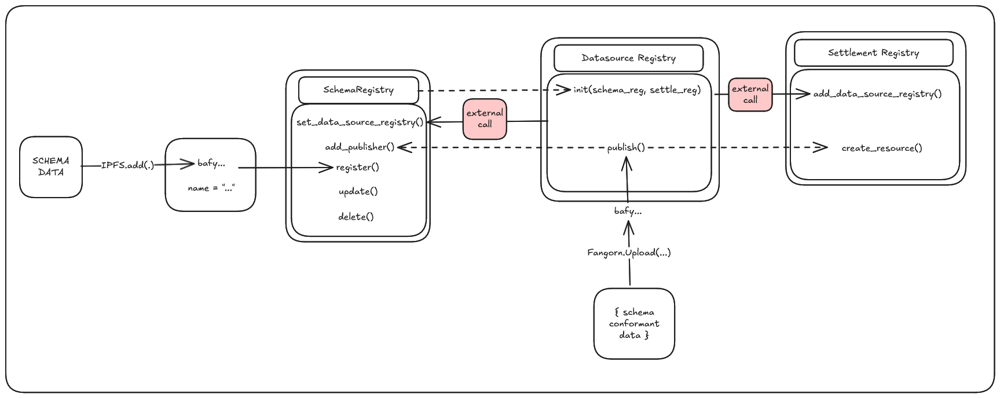

# how it works

This is a basic description of the core contracts and interactions between them.

## Contracts Overview

### Schema Registry

### Settlement Registry

### Datasource Registry

## Flows

### Schema Registration

### Data Registration
- schema must exist
- createResource in settlement registry if new item, else update price
